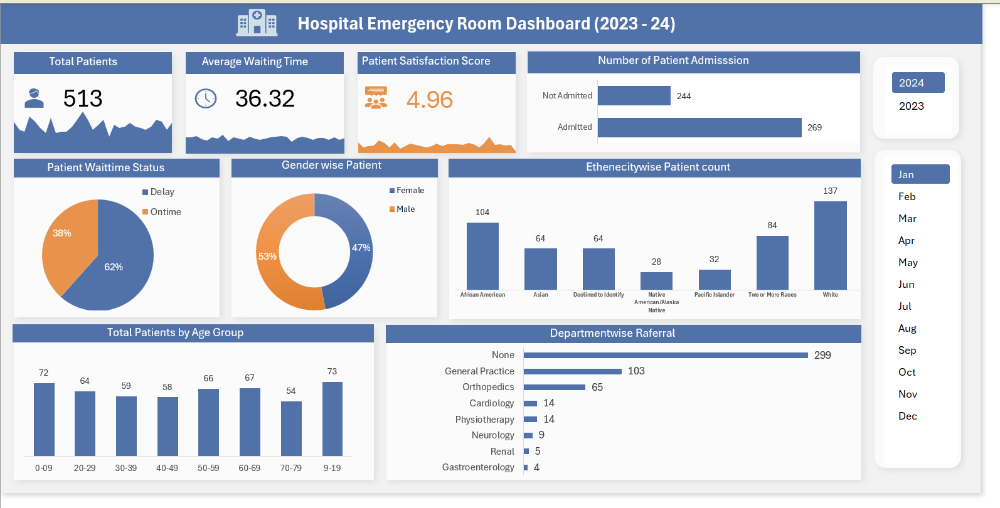

# 🏥 Hospital Emergency Room Data Analysis Dashboard (Excel)

## 📌 Project Overview

This project analyzes Hospital Emergency Room (ER) data using Microsoft Excel to monitor patient flow, treatment efficiency, and operational performance.

The objective of this project was to clean and transform raw hospital data, calculate key performance metrics, and build an interactive dashboard to help stakeholders make data-driven decisions.

This project demonstrates my ability to perform data cleaning, KPI calculation, and dashboard development using Excel as a business intelligence tool.

---

## 🎯 Business Objectives

- Monitor total ER patient visits  
- Analyze patient admission vs non-admission rates  
- Track average waiting time  
- Identify peak visit hours and busiest days  
- Evaluate department-wise patient distribution  
- Improve operational efficiency through data insights  

---

## 🛠 Tools & Skills Used

- Microsoft Excel  
- Data Cleaning & Data Validation  
- Pivot Tables & Pivot Charts  
- KPI Calculation  
- Conditional Formatting  
- Slicers for Interactivity  
- Dashboard Design & Layout Structuring  

---

## 📂 Dataset Description

The dataset includes:

- Patient ID  
- Visit Date  
- Gender  
- Age  
- Department  
- Admission Status  
- Waiting Time  
- Treatment Type  
- Visit Outcome  

---

## 🔎 Key Insights

- Peak ER visits observed during specific days/months  
- Certain departments handle the highest patient volume  
- Admission rate indicates overall severity trend  
- Average waiting time highlights operational efficiency  
- Gender distribution shows demographic trends  

---

## 📈 Business Impact

- Helps hospital management monitor ER load  
- Identifies bottlenecks in patient handling  
- Supports resource allocation decisions  
- Enables performance tracking through structured KPIs  

---

## 🚀 What I Learned

- Cleaning and structuring healthcare datasets  
- Creating dynamic KPI-driven dashboards  
- Analyzing time-based trends in Excel  
- Translating healthcare data into actionable insights  
- Designing professional, interactive reports

---

## 📎 Project Files

- 📊 [Hospital ER Dashboard (Excel File)](Hospital ER Project File (Excel).xlsx)
- 📁 [Raw Dataset](Hospital_ER_Dataset.xlsx)
- ## 📸 Dashboard Preview

